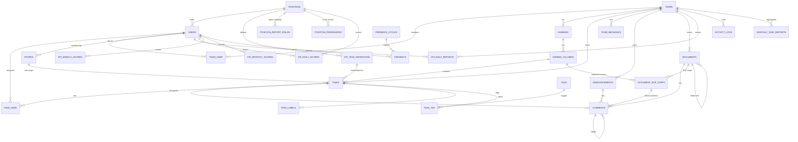

# OCB KPI Management — Technical Documentation

**Application:** OCB KPI Management (`todo-app-v2`)
**Type:** Laravel + Inertia (React) monolithic SPA
**Audience:** Developers, DevOps, technical maintainers
**Last generated:** 2026-08-09

---

## Table of Contents

1. [Overview](#1-overview)
2. [Tech Stack](#2-tech-stack)
3. [System Requirements](#3-system-requirements)
4. [Setup & Installation](#4-setup--installation)
5. [Environment Configuration](#5-environment-configuration)
6. [Development Workflow](#6-development-workflow)
7. [Testing](#7-testing)
8. [Architecture](#8-architecture)
9. [Data Model & ERD](#9-data-model--erd)
10. [Domain Modules](#10-domain-modules)
11. [KPI Scoring Engine](#11-kpi-scoring-engine)
12. [Scheduled Jobs & Queue](#12-scheduled-jobs--queue)
13. [Access Control (RBAC + Positions)](#13-access-control-rbac--positions)
14. [API Reference](#14-api-reference)
15. [AI Integrations](#15-ai-integrations)
16. [Deployment](#16-deployment)
17. [Troubleshooting](#17-troubleshooting)

---

## 1. Overview

OCB KPI Management is a task-management and KPI-evaluation platform for a multi-branch retail/operations organization. It combines:

- **Team collaboration** — Kanban boards, tasks, comments, documents, announcements, chat.
- **KPI evaluation** — weighted daily task definitions per position, evidence upload, AI compliance scoring, and daily → weekly → monthly score aggregation with grading.
- **Position-based access** — a data-driven RBAC layer where each user's *position* determines which functional area (HR, Operational, Gudang, SPV, …) they can reach.
- **Reporting** — daily reports per position (dynamic field templates), AI-generated monthly task recaps, and a CEO monitoring suite.

The whole app is a server-driven SPA: Laravel renders React pages through Inertia, so there is no separate frontend server in production.

All KPI time logic runs in **Asia/Makassar (WITA, UTC+8)**.

---

## 2. Tech Stack

| Layer | Technology | Version |
|-------|-----------|---------|
| Language (backend) | PHP | 8.4 |
| Framework | Laravel | 13.x |
| Frontend | React | 19 |
| SPA bridge | Inertia.js (`inertiajs/inertia-laravel` + `@inertiajs/react`) | v3 |
| Styling | Tailwind CSS | 4 |
| Build tool | Vite | 7 (+ `@laravel/vite-plugin-wayfinder`) |
| Typed routes | Laravel Wayfinder | v0 |
| Auth backend | Laravel Fortify (2FA capable) | v1 |
| API tokens | Laravel Sanctum | v4 |
| Realtime | Laravel Echo | v2 |
| Roles/permissions | spatie/laravel-permission | — |
| Media / uploads | spatie/laravel-medialibrary | — |
| Observability | Laravel Nightwatch | v1 |
| Testing | Pest | v4 (PHPUnit 12) |
| Formatting | Laravel Pint (PHP), Prettier + ESLint (TS) | — |
| Local env | Laravel Herd | — |
| Database | MySQL (prod) / SQLite (default local & tests) | — |
| Attendance DB | External MySQL `absen_management` (read-only `absen` connection) | — |

Models registered in the app: `Team`, `Task`, `Comment`, plus the full KPI/position/document domain (see [§9](#9-data-model--erd)).

---

## 3. System Requirements

- PHP **8.4** with typical Laravel extensions (`pdo`, `mbstring`, `openssl`, `gd`/`imagick` for media conversions).
- Composer 2.
- Node.js 20+ and npm.
- A database: MySQL 8 in production, SQLite works out of the box for local/testing.
- **Attendance database** (`absen_management`) — a second, read-only MySQL schema on the same server, powering the KPI attendance gate. Provided by the external attendance system.
- Optional: Redis (queue/cache), an S3-compatible bucket (media at scale).
- Optional AI keys: OpenAI / Anthropic / Gemini, or a self-hosted **9Route** gateway, for SOP parsing, task compliance checks, and monthly report generation.

---

## 4. Setup & Installation

### Quick start (Composer script)

```bash
composer run setup
```

`setup` runs: `composer install` → copy `.env` → `key:generate` → `migrate --force` → `npm install` → `npm run build`.

### Manual steps

```bash
# 1. Clone
git clone <repository-url>
cd todo-app-v2

# 2. Backend deps
composer install

# 3. Frontend deps
npm install

# 4. Environment
cp .env.example .env
php artisan key:generate

# 5. Database (SQLite default — file is created automatically)
php artisan migrate

# 6. Seed baseline data
php artisan db:seed

# 7. Build assets
npm run build
```

### Seeders

`php artisan db:seed` runs `DatabaseSeeder`, which orchestrates the domain seeders. Notable individual seeders:

| Seeder | Purpose |
|--------|---------|
| `RolePermissionSeeder` | Creates `superadmin`, `admin`, `user` roles + permissions |
| `SuperAdminSeeder` | Creates `superadmin@example.com` with the superadmin role |
| `PositionGroupSeeder` | Seeds the position hierarchy (Direktur → Manager → SPV → Staff → Tim) |
| `KpiTaskDefinitionSeeder` | Manager HR + Manager Operasional KPI task templates |
| `KpiGudangKurirSeeder` | Gudang/Kurir KPI definitions |
| `KpiSpvUnit1Seeder` | SPV Unit 1 KPI definitions |
| `PositionReportFieldSeeder` | Daily-report field templates per position |
| `StoreSeeder` | Store/branch locations (OC codes) |

Run one seeder explicitly:

```bash
php artisan db:seed --class=KpiTaskDefinitionSeeder
```

### Default login

After seeding: `superadmin@example.com` (set/verify the password via the seeder or a manual reset).

---

## 5. Environment Configuration

Key `.env` values beyond the Laravel defaults:

```dotenv
APP_NAME="OCB KPI Management"

# Primary database — SQLite by default; switch to mysql for production
DB_CONNECTION=mysql
DB_HOST=127.0.0.1
DB_PORT=3306
DB_DATABASE=kpi_ocb
DB_USERNAME=root
DB_PASSWORD=

# Attendance database (absen_management) — READ-ONLY second connection.
# Host/port/user/pass fall back to the primary DB envs if omitted (same MySQL
# server). Only the database name usually differs.
DB_ABSEN_DATABASE=absen_management
# DB_ABSEN_HOST=127.0.0.1
# DB_ABSEN_PORT=3306
# DB_ABSEN_USERNAME=root
# DB_ABSEN_PASSWORD=

# Queue / cache / session all default to the database driver
QUEUE_CONNECTION=database
CACHE_STORE=database
SESSION_DRIVER=database

# Observability
NIGHTWATCH_ENABLED=true
NIGHTWATCH_TOKEN=

# --- AI providers (optional) ---
# Task-compliance provider is selectable: openai | anthropic | gemini | 9route
AI_TASK_CHECK_ENABLED=true
AI_TASK_CHECK_PROVIDER=openai

OPENAI_API_KEY=
OPENAI_BASE_URL=https://api.openai.com/v1
OPENAI_REPORTING_MODEL=gpt-5-mini
OPENAI_TASK_CHECK_MODEL=gpt-5.4-nano

ANTHROPIC_API_KEY=
ANTHROPIC_BASE_URL=https://api.anthropic.com/v1
ANTHROPIC_REPORTING_MODEL=claude-haiku-4-5-20251001

GEMINI_API_KEY=
GEMINI_REPORTING_MODEL=gemini-2.5-flash

# 9Route — local OpenAI-compatible AI gateway (self-hosted)
NINE_ROUTE_API_KEY=sk-9route
NINE_ROUTE_BASE_URL=http://localhost:20128/v1
NINE_ROUTE_MODEL=sumopod/gpt-5.1
NINE_ROUTE_TASK_CHECK_MODEL=claude-haikyu

# --- KPI behaviour flags ---
# Allow daily reports to be submitted/edited for PAST dates (default: today only)
KPI_ALLOW_BACKDATED_REPORT=false
```

Flag reference:

- **`AI_TASK_CHECK_ENABLED`** — toggles the AI compliance check on task evidence. When off, evidence scoring falls back to the deterministic three-tier rule.
- **`AI_TASK_CHECK_PROVIDER`** — which AI backend scores task evidence: `openai` (default), `anthropic`, `gemini`, or `9route` (local gateway). SOP parsing auto-selects the first provider with a configured key.
- **`DB_ABSEN_*`** — read-only connection to the external attendance schema (`absen_management`). Powers the KPI **attendance gate** (see [§11](#11-kpi-scoring-engine)). Host/user/pass default to the primary DB envs; usually only `DB_ABSEN_DATABASE` is set.
- **`KPI_ALLOW_BACKDATED_REPORT`** — when `true`, users may submit/edit daily reports for past dates (future dates always rejected; the 80% KPI-task completion gate still applies per date).

---

## 6. Development Workflow

### Run everything at once

```bash
composer run dev
```

This starts four concurrent processes (named `server`, `queue`, `logs`, `vite`):

- `php artisan serve` — app server
- `php artisan queue:listen` — queue worker
- `php artisan pail` — live log tail
- `npm run dev` — Vite HMR

> With **Laravel Herd** the site is always served at `http://todo-app-v2.test` — you only need `npm run dev` for asset HMR, not `php artisan serve`.

### Individual commands

```bash
npm run dev            # Vite dev server (HMR)
npm run build          # Production asset build
npm run build:ssr      # Build with SSR bundle
vendor/bin/pint        # Format PHP (run --dirty before committing)
npm run lint           # ESLint --fix
npm run format         # Prettier write
npm run types:check    # tsc --noEmit
```

### Wayfinder (typed routes)

Frontend calls backend routes through generated TypeScript functions imported from `@/actions/*` (controllers) and `@/routes/*` (named routes). Regenerate after changing routes/controllers:

```bash
php artisan wayfinder:generate
```

The Vite plugin also regenerates on dev. **Never hardcode URLs in the React layer** — import the Wayfinder function and call `.url()`, `.get()`, `.post()`, or `.form()`.

### Code style gate

```bash
composer run ci:check   # lint:check + format:check + types:check + tests
```

Always run `vendor/bin/pint --dirty` after editing PHP.

---

## 7. Testing

The project uses **Pest 4** on top of PHPUnit 12. Tests default to SQLite with `RefreshDatabase`.

### Commands

```bash
php artisan test                       # full suite (config:clear + lint:check + tests via composer)
php artisan test --compact             # compact output
php artisan test --filter=GudangKpi    # single test/group
php artisan test tests/Feature/Api      # a directory
```

> Per project convention, `composer run test` also runs `config:clear` and `lint:check` first.

### Layout

```
tests/
├── Pest.php                 # bindings, global helpers
├── TestCase.php
├── Unit/                    # pure logic (SopAiParser, SopAuditStepParser, …)
└── Feature/                 # HTTP + integration
    ├── Auth/                # Fortify flows (login, 2FA, password reset, verification)
    ├── Settings/            # profile + security
    ├── Feedback/            # feedback + survey + admin
    ├── Api/V1/              # mobile + agent API contracts
    ├── Models/              # model-level behaviour
    └── Http/Controllers/    # controller-level behaviour
```

### Coverage highlights

Feature tests cover the KPI engine (`GudangKpiTest`, `KpiMinimumPhotosTest`, `KpiVideoRequirementTest`, `KpiAutoDoneReportTest`, `KpiCeoDashboardTest`), dynamic report templates, SOP management/parsing, monthly task reporting, the SPV flag flows, and the mobile/agent APIs (`MobileAuthApiTest`, `MobileTaskApiTest`, `AgentDailyReportApiTest`, `DailyReporterApiTest`).

### Conventions

- Every change must be tested — add or update a test, then run the affected file/filter.
- Use factories (with custom states) for model setup; use `fake()`/`$this->faker` per existing file style.
- Create tests with `php artisan make:test --pest {Name}` (add `--unit` for unit tests).
- Do not delete tests without approval.

---

## 8. Architecture

### High-level request flow

```
Browser (React 19 SPA)
   │  Inertia visit / XHR
   ▼
Laravel Router  ──►  Middleware stack
   │                   • auth, verified
   │                   • role:… (spatie)
   │                   • position:… / {area} (CheckPositionAccess, ValidateKpiArea)
   ▼
Controller  ──►  Service layer (KpiScoringService, …)  ──►  Eloquent Models ──► DB
   │
   ▼
Inertia::render('page', props)  ──►  React page (resources/js/pages/**)
```

### Directory map (backend)

```
app/
├── Console/Commands/     # KPI schedulers, recurring announcements, reminders
├── Concerns/             # shared validation-rule traits
├── Enums/                # GroupingType (hq/team/project)
├── Events/               # TeamMessageSent (broadcast)
├── Exports/              # FeedbackExport (xlsx)
├── Http/
│   ├── Controllers/      # web + Api/V1 controllers
│   ├── Middleware/       # CheckPositionAccess, ValidateKpiArea, HandleInertiaRequests, …
│   └── Requests/         # FormRequest validation
├── Jobs/                 # CheckTaskComplianceJob, ParseTeamSopJob, GenerateMonthlyTaskReportJob, …
├── Models/               # domain models
├── Observers/            # Task, Team, Comment observers (activity logging, side effects)
├── Policies/             # Task, Team, Announcement, Document authorization
├── Providers/            # AppServiceProvider, FortifyServiceProvider
├── Services/             # business logic (scoring, reporting, AI, SOP parsing)
└── Support/Kpi/          # ValidAreasResolver (dynamic area cache)
```

### Directory map (frontend)

```
resources/js/
├── app.tsx               # Inertia app bootstrap
├── echo.ts               # Laravel Echo setup
├── pages/                # one file per Inertia page (dashboard, teams, kpi/**, hr/**, …)
│   └── teams/partials/   # tab components (overview, tugas, sop, dokumen, chat, …)
├── layouts/              # shared layouts
├── components/           # reusable UI (incl. camera-capture.tsx)
├── hooks/                # React hooks
├── actions/ + routes/    # Wayfinder-generated typed route helpers
├── lib/                  # helpers (date math, formatting)
└── types/                # shared TS types
```

### Key architectural patterns

- **Service layer** — controllers stay thin; scoring, reporting, SOP parsing, and AI calls live in `app/Services`.
- **Observers** — `TaskObserver`, `TeamObserver`, `CommentObserver` handle side effects (activity logging, system-log comments) so controllers don't.
- **Data-driven config** — "who reports" and "which areas exist" are derived from the database (`position_report_fields`, `positions.area_slug` + `has_kpi`) via `Position::hasReportTemplate()` and `ValidAreasResolver`, not hardcoded lists.
- **UUID primary keys** — most domain tables (`teams`, `tasks`, `comments`, `kpi_*`, `documents`, `positions`) use `char(36)` UUIDs (`HasUuids`). `users`, `stores`, and Laravel/Spatie infra tables keep auto-increment `bigint`.
- **Polymorphic media** — uploads (avatars, task evidence, comment media, team-message attachments) go through Spatie Media Library's `media` table.

---

## 9. Data Model & ERD

### 9.1 Entity Relationship Diagram (Mermaid)



> The Mermaid block renders as a diagram in the HTML/PDF outputs and on GitHub. A plain-text summary follows for environments without Mermaid.

### 9.2 Core entities (text summary)

| Entity | Key | Purpose | Notable relations |
|--------|-----|---------|-------------------|
| **users** | bigint | People (auth, 2FA, avatar) | `belongsTo position`; `belongsToMany teams`, `tasks` |
| **positions** | uuid | Job positions; drive KPI + area access | `hasMany users, kpiDefinitions, reportFields, permissions` |
| **teams** | uuid | Collaboration units | `hasMany kanbans, tasks, messages, announcements, documents` |
| **kanbans** | uuid | Boards within a team | `hasMany columns` |
| **kanban_columns** | uuid | Board columns (`is_done`, `is_default`) | `hasMany tasks` |
| **tasks** | uuid | Work items / KPI task instances | `belongsTo team, column, store, creator, kpiDefinition`; `hasMany comments, labels`; `belongsToMany assignees, tags` |
| **comments** | uuid | Threaded comments + evidence + system logs | `belongsTo task/announcement/document, user, parent, sopStep`; `hasMany replies`; has media |
| **stores** | bigint | Branch/store locations (OC codes) | `belongsTo spv (user)` |
| **tags / task_labels** | uuid | Task categorization | many-to-many / one-to-many with tasks |

### 9.3 KPI entities

| Entity | Purpose |
|--------|---------|
| **kpi_task_definitions** | Weighted task template per position: `weight`, `category`, `work_method`, `verification_method`, flags (`can_upload_proof`, `auto_done_on_report`, `require_video_upload`, `minimum_photos`). |
| **kpi_daily_reports** | A user's daily report: dynamic `fields` (JSON), `attachments`, `is_late`, `submitted_at`. |
| **kpi_daily_scores** | Computed per user/day: `total_score`, `completed_weight`, `grade`, `category_breakdown`, `task_details`. |
| **kpi_weekly_scores** | 7-day average roll-up with grade. |
| **kpi_monthly_scores** | 4-week average + consistency bonus, `has_grade_d`, `final_score`, `grade`. |
| **position_report_fields** | Daily-report field template (key, label, type, options, group, order, required). |
| **kpi_aset_pantau** | Externally-fetched monitoring metrics per subject/period feeding KPI. |

### 9.4 Document / SOP entities

- **documents** — folder tree (`parent_id`), file or page (`type`), optional SOP with async parse status fields (`sop_parse_status`, platform, timestamps).
- **document_sop_steps** — parsed SOP steps: `sequence_order`, `action`, `keywords` (JSON), `required_evidence`, `weight`, scoring thresholds (`score_kurang/cukup/sangat_baik`), `expected_column`, `kanban_column_id`.

### 9.5 Support / infra tables

`activity_logs` (polymorphic audit, team-scoped) · `announcements` (recurring reminder engine) · `team_messages` (chat, broadcast) · `feedback` + `feedback_cycles` · `monthly_task_reports` (AI recap payloads) · `media` (Spatie) · `roles`/`permissions`/`model_has_*` (Spatie) · `personal_access_tokens` (Sanctum) · `jobs`/`failed_jobs`/`job_batches` · `cache`/`sessions`.

**External (read-only, `absen` connection):** `absen_management.absensi` — one row per attendance tap (`Absensi` model, `user_id`, `absen_time`, `is_valid`). Linked to app users via `users.absen_user_id`. Never written by this app.

---

## 10. Domain Modules

### Teams & collaboration
A team owns kanbans, tasks, documents, announcements, chat, and an activity log. The team page (`teams/show`) is tabbed: overview, tugas (tasks/kanban), SOP, dokumen, chat, pengumuman, activity, and (for SPV teams) svp-stores. Route: `teams/{team:slug}/{tab?}/{item?}`.

### Tasks & Kanban
Tasks live in kanban columns and can be reordered via drag-and-drop (`kanbans.tasks.reorder`). Tasks carry assignees, tags, labels, comments (with media evidence), and optionally link to a `kpi_task_definition` (`is_kpi_task`). Store-visit tasks carry `store_id` and `visit_date`.

### Documents & SOP
Documents form a folder tree. A document flagged `is_sop` can be parsed by AI (`ParseTeamSopJob` → `SopAiParser`) into `document_sop_steps`, each mappable to an expected kanban column and scored against evidence via `TaskColumnScoringService` / `SopAuditStepParser`.

### Announcements (recurring reminders)
Announcements can be one-off or recurring. A template row generates occurrences; `ProcessRecurringAnnouncementReminder` + the `DispatchRecurringAnnouncements` scheduled command (runs every second, `withoutOverlapping`) materialize the next occurrence based on `recurrence_*` fields.

### Feedback & survey
A floating feedback button posts quick feedback anytime. CEO opens/closes **survey cycles**; users submit one comprehensive survey per open cycle. Admins view/export (`FeedbackExport` → xlsx).

### Activity log
`ActivityLogger` + model observers write polymorphic `activity_logs` scoped by team, viewable at `/activity` (admin).

---

## 11. KPI Scoring Engine

Owned by `KpiScoringService` (+ `KpiReportingService`, `KpiTaskGenerationService`, `KpiNotificationService`).

### Task generation (attendance-gated, manual)
`KpiTaskGenerationService::generateDailyTasksForUser` instantiates `tasks` from each active `kpi_task_definition` for a KPI-enabled position. SPV users select an assigned store first, then generate per-store visit tasks with a `visit_date` (due date = H+1).

**Generation is manual + attendance-gated — the old 00:01 bulk cron is disabled.** `KpiDashboardController::generateTasks` requires `AttendanceService::hasCheckedInOn($user, $date)` to return `true` before any task is created:

- `AttendanceService` queries the read-only `absen` connection (`App\Models\Absen\Absensi`, table `absensi` in `absen_management`), matching on `user_id = users.absen_user_id` with `is_valid = 1` for the date.
- Users with `absen_user_id = null` are treated as **not checked in** → generation blocked (`"Anda belum absen hari ini…"`).
- The `absen_user_id` mapping is added by migration `2026_08_04_132910_add_absen_user_id_to_users_table`, which auto-seeds it by matching `users.name` to `absen_management.user.name`. Unmatched users must be mapped by hand.

Rationale (see `routes/console.php` comment): a midnight bulk generation would run before anyone checks in and bypass the gate, so it is intentionally left commented out. The `app:kpi-generate-daily-tasks` command still exists for manual/debug use.

### Evidence & verification
A task is verified when its evidence satisfies the definition's requirements:

- **Comment + photo** → baseline pass.
- **`minimum_photos`** — at least N photos **within a single comment** (photos spread across comments don't count).
- **`require_video_upload`** — a video attachment must exist among comment media.
- **`auto_done_on_report`** — task auto-verifies when the daily report is submitted (no independent evidence); total auto-done weight per position capped at **10%**.

Both requirements are enforced server-side (`verifyTask`, `calculateDailyScore`) and gated in the task-modal UI.

### Scoring tiers (structural fallback)
Used only for tasks **without** an AI compliance flow (`ai_check_status === null`), e.g. legacy tasks:

| Evidence | Comment | Attachment | Credit |
|----------|:-------:|:----------:|:------:|
| Full | ✓ | ✓ | 100% |
| Partial | ✓ | ✗ | 30% |
| None | ✗ | ✗ | 0% |

`require_video_upload` and `minimum_photos` cap an otherwise-full tier at partial until satisfied.

### AI compliance credit (tasks with a definition)
When a task has a `kpi_task_definition`, `KpiScoringService::calculateDailyScore` reads `ai_check_status` instead of the flat tier:

| `ai_check_status` | Credit (weight multiplier) |
|-------------------|----------------------------|
| `passed` (AI score ≥ 75) | **100%** — full weight, auto-verified |
| `exhausted` (3 attempts, never ≥ 75) | **partial** = `ai_compliance_score / 100` |
| `pending` / `failed` | **0%** — user must resubmit |
| `auto_done_on_report` + verified | **100%** regardless of evidence |

See [§15](#15-ai-integrations) for how the 0–100 score is produced.

### Aggregation
```
Daily score   = Σ(completed_weight) vs Σ(total_weight)   → grade
Weekly score  = average of the week's daily scores
Monthly score = average of the 4 weekly scores + consistency bonus
```

### Grading
| Grade | Range | Action |
|-------|-------|--------|
| A+ | 95–100% | Reward / promotion consideration |
| A | 85–94% | On target |
| B | 70–84% | Weekly coaching |
| C | 50–69% | Warning, SP1 + 30-day plan |
| D | <50% | Critical, SP2/SP3 + evaluation |

**Consistency bonus:** +5% monthly if no grade D occurred in the month (`has_grade_d = false`).

---

## 12. Scheduled Jobs & Queue

Defined in `routes/console.php`, all in **Asia/Makassar**:

| Command | Schedule (WITA) | Purpose |
|---------|-----------------|---------|
| `app:kpi-generate-daily-tasks` | **disabled** (commented out) | Bulk generation bypasses the attendance gate; tasks are generated manually per user instead. Command kept for manual/debug use. |
| `app:kpi-calculate-daily-scores` | daily 23:00 | Compute daily scores after the deadline |
| `app:kpi-send-report-reminder` | daily 21:00 | Remind reporters to submit |
| `app:kpi-calculate-weekly-scores` | Monday 01:00 | Weekly roll-up |
| `app:kpi-calculate-monthly-scores` | 1st of month 02:00 | Monthly roll-up + bonus |
| `DispatchRecurringAnnouncements` | every second (`withoutOverlapping`) | Materialize recurring announcement occurrences |

Run the scheduler in production via a single cron entry:

```cron
* * * * * cd /path-to-app && php artisan schedule:run >> /dev/null 2>&1
```

### Queue

`QUEUE_CONNECTION=database`. Async jobs: `CheckTaskComplianceJob` (AI task check), `ParseTeamSopJob` (SOP parsing), `GenerateMonthlyTaskReportJob` (AI monthly recap), `ProcessRecurringAnnouncementReminder`. Run a worker:

```bash
php artisan queue:listen --tries=1 --timeout=0     # dev (part of composer run dev)
php artisan queue:work                             # prod (supervised)
```

---

## 13. Access Control (RBAC + Positions)

Two complementary layers:

**1. Roles (spatie/laravel-permission)** — `superadmin`, `admin`, `member`. Applied with the `role:` middleware, e.g. `role:superadmin|admin`.

**2. Positions (area access)** — each `position` has an `area_slug` (`hr`, `operational`, `gudang`, `spv`, …) and `has_kpi`. The `position:` and `{area}` middleware (`CheckPositionAccess`, `ValidateKpiArea`) restrict area routes; `position_permissions` maps route keys to positions.

Effective rules:

- **Superadmin** — bypasses all position checks; reaches every area and the CEO/admin suite.
- **Admin** — restricted to the area matching their position (Manager HR → HR only, Manager Operasional → Operational only).
- **Generic Manager** — permission for both HR and Operational areas.
- **Line positions** (Gudang, SPV, …) — only their own area.

The generic `{area}/kpi/*` route group means **any** position with `area_slug + has_kpi` becomes reachable with no code change — add the position + report template and it works (`ValidAreasResolver` refreshes the valid-area cache on position save/delete).

Area route map (each area has the same KPI sub-routes):

```
/{area}/kpi/dashboard
/{area}/kpi/daily/{date?}
/{area}/kpi/weekly/{weekStart?}
/{area}/kpi/monthly/{month?}
/{area}/kpi/report/create        POST report/submit, GET report/{report}/edit
/{area}/kpi/reports
POST /{area}/kpi/tasks/generate
POST /{area}/kpi/tasks/{task}/verify
```

Superadmin-only admin/CEO routes:

```
/kpi/admin/definitions          # CRUD KPI task templates (weight must total 100%)
/kpi/admin/report-fields        # CRUD daily-report field templates
/kpi/admin/scores
/kpi/ceo/dashboard | daily-reports | alerts | spv | user/{user}
```

---

## 14. API Reference

Two API surfaces live in `routes/api.php`, both returning JSON.

### 14.1 AI-read / integration API (Sanctum or key-guarded)

Read endpoints for agents/integrations to pull team context:

```
GET  api/teams                              # list
GET  api/teams/{team}                        # show
GET  api/teams/{team}/context                # aggregated context
GET  api/teams/{team}/digest
GET  api/teams/{team}/entity-map
GET  api/teams/{team}/search
GET  api/teams/{team}/tasks | members | kanbans | documents | announcements | messages | activity-logs
GET  api/tasks/{task} | api/documents/{document} | api/announcements/{announcement}
POST api/teams/{team}/resolve-references
```

### 14.2 Public reporting feeds

```
GET api/reports/daily-manager                 # H-1 manager reports (submitted + pending) + field templates + KPI task detail
GET api/reports/daily-reporters?date=Y-m-D     # feed for every reporting position; defaults to yesterday
```

`daily-reporters` returns `reports` (submitted field values only) and `pending` (not yet submitted); each row includes a `store` object (`id`, `name`, `branch_code`) or `null`.

### 14.3 Mobile API (`/api/v1`, Sanctum tokens)

```
POST   api/v1/auth/login | logout
GET    api/v1/me | me/teams
GET    api/v1/dashboard
GET    api/v1/tags
POST   api/v1/tasks
PATCH  api/v1/tasks/{task}          DELETE api/v1/tasks/{task}
POST   api/v1/tasks/{task}/comments
GET    api/v1/teams/{team}/tasks | context | kanbans | messages | announcements | documents
POST   api/v1/teams/{team}/messages | announcements
POST   api/v1/teams/{team}/documents/{files|folders|pages}
PATCH/DELETE api/v1/comments/{comment}
POST   api/v1/kanbans/tasks/reorder
GET    api/v1/reports/monthly-tasks | monthly-tasks/recap-per-user | monthly-tasks/show
GET    api/v1/internal/reports/monthly-tasks[/recap-per-user]
```

Contract details are documented under `docs/api-contract/` and `docs/*_contract_*.md`.

Full route dump:

```bash
php artisan route:list --except-vendor
```

---

## 15. AI Integrations

Three AI-backed features, provider-configurable (OpenAI / Anthropic / Gemini / 9Route):

| Feature | Service / Job | Provider selector | Notes |
|---------|---------------|-------------------|-------|
| **Task compliance check** | `AiTaskCheckService` / `CheckTaskComplianceJob` | `AI_TASK_CHECK_PROVIDER` (`openai`\|`9route`) | AI returns a **direct 0–100** compliance score for how well the evidence comment matches the task's `work_method` + `verification_method`. **Passes at ≥ 75** (`PASS_THRESHOLD`). Max 3 attempts; exhausted = partial credit (`score/100 × weight`). System failures don't burn an attempt. Toggle with `AI_TASK_CHECK_ENABLED`. |
| **SOP parsing** | `SopAiParser` / `ParseTeamSopJob` | any of the four | Parses SOP markdown or PDF (via Media Library) into structured `document_sop_steps`. Tracks `sop_parse_status` + platform. |
| **Monthly task recap** | `AiReportingService` / `GenerateMonthlyTaskReportJob` | `*_REPORTING_MODEL` | Aggregates a month of tasks into a per-user recap stored in `monthly_task_reports` (payload, model, prompt_version, snapshot). |

### Task-compliance scoring model (current)

The AI is prompted (Indonesian system prompt in `AiTaskCheckService::systemPrompt`) to be **lenient** and return one JSON object `{"score": 0–100, "feedback": "…"}`:

- **90–100** — evidence explains work method AND matches verification method.
- **75–89** — core work matches, minor gaps (still accepted).
- **55–74** — under-explains (rejected, asks for fixes).
- **0–54** — irrelevant / not compliant (rejected).

`CheckTaskComplianceJob` maps: `score ≥ 75 → passed` (verified, full weight); `< 75 & attempts left → failed` (resubmit); `< 75 & attempts exhausted → exhausted` (partial credit). Evidence structure (comment + photo) is verified as "full" *before* the job runs — the AI only judges content relevance.

### 9Route gateway

`9route` is a self-hosted, OpenAI-compatible AI gateway (default `http://localhost:20128/v1`). Configure via `NINE_ROUTE_*` env keys (`config/services.php` → `9route`). Used for both task-compliance checks and SOP parsing when selected. Lets the deployment run AI features against a local/on-prem model without external API calls.

Prompt/version details live in `docs/feedback-prompt.md`, `docs/ai-read-api.md`, and `docs/plan-ai-task-check.md`.

---

## 16. Deployment

### Build

```bash
composer install --no-dev --optimize-autoloader
npm ci && npm run build       # or npm run build:ssr for SSR
php artisan migrate --force
php artisan config:cache route:cache view:cache
```

### Runtime processes

- **Web** — PHP-FPM + Nginx/Caddy (or Laravel Cloud / Herd for dev).
- **Queue worker** — `php artisan queue:work` under Supervisor/systemd.
- **Scheduler** — one cron line calling `schedule:run` every minute.

### Production `.env` musts

- `APP_ENV=production`, `APP_DEBUG=false`, real `APP_KEY`.
- `DB_CONNECTION=mysql` with credentials.
- Set `NIGHTWATCH_TOKEN` if using Nightwatch.
- Provide AI keys only for the providers you enable.
- Confirm `TZ`/scheduler timezone assumptions — KPI logic pins **Asia/Makassar** regardless of server TZ.

Laravel Cloud is the fastest supported path (per Laravel deployment guidance).

### Observability

Nightwatch is wired in (`NIGHTWATCH_ENABLED`, dashboard URL configurable). A superadmin-only in-app log viewer is available at `/log-viewer` and Nightwatch at `/nightwatch`.

---

## 17. Troubleshooting

| Symptom | Cause / Fix |
|---------|-------------|
| `ViteException: Unable to locate file in Vite manifest` | Assets not built — run `npm run build` (or `npm run dev`). |
| Frontend change not visible | Rebuild: `npm run build` / `npm run dev` / `composer run dev`. |
| Route function missing in TS (`@/actions`, `@/routes`) | Run `php artisan wayfinder:generate`. |
| KPI tasks not appearing | Generation is manual + attendance-gated. Confirm the user checked in today (has a valid `absensi` row and a non-null `users.absen_user_id`), the position has active definitions and `has_kpi`, then click **Generate Task**. |
| "Anda belum absen hari ini" on generate | No valid `absensi` row for the date, or `users.absen_user_id` is null. Verify the `absen` connection reaches `absen_management` and the user is mapped. |
| Attendance DB errors / `absen` connection refused | Check `DB_ABSEN_*` (defaults inherit primary DB host/user/pass); the `absen_management` schema must exist and be reachable. |
| Scores never computed | Ensure the scheduler cron runs; scores compute at 23:00 WITA. |
| AI check stuck / no score | Verify `AI_TASK_CHECK_ENABLED=true`, provider key set, and the queue worker is running. |
| Daily report rejected for a past date | `KPI_ALLOW_BACKDATED_REPORT=false` — today only. Set `true` to allow backdating. |
| Report marked TERLAMBAT / rejected | Late threshold 22:30 WITA; hard cutoff at 23:00 WITA. |
| Position area returns 403 | Position lacks `area_slug`/`has_kpi` or a `position_permissions` entry; superadmin bypasses all checks. |

---

*Generated for the OCB KPI Management platform. For end-user instructions, see the companion **User Manual**.*
